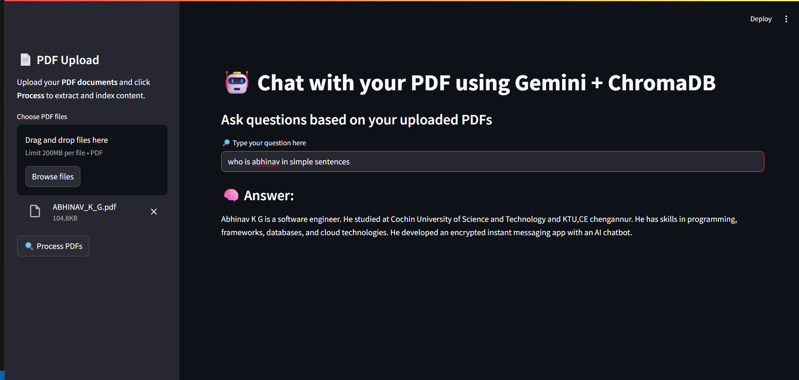

# Week-2

## 📄 Chat with your PDF using Gemini + ChromaDB

This project is a Streamlit-based PDF chatbot that allows you to upload PDF documents, process and index them using **Google Gemini embeddings** and **ChromaDB**, and then ask natural language questions. It uses **Google's Generative AI** to provide contextual answers based on the uploaded content.

---

### 🚀 Features

- 📥 Upload and process multiple PDFs
- 🔍 Extract text and split into semantic chunks
- 📚 Create a vector store using ChromaDB and Gemini embeddings
- 🤖 Ask questions and receive accurate, contextual answers
- 💬 Clean and styled output box for a better user experience

---

### 🛠 Tech Stack

- **Python**
- **Streamlit** – for the user interface
- **Google Generative AI (Gemini)** – for embeddings and LLM-based responses
- **ChromaDB** – for storing and retrieving vectorized text chunks
- **LangChain** – for prompt engineering and QA chain

---
### 📸 Output Screenshot




### 📦 How to run:
- create a virtual environment(.env) and add GENAI_API_KEY=your_google_gemini_api_key
 ```bash
 python -m venv venv
 # Activate it
# On Windows
venv\Scripts\activate
# On macOS/Linux
source venv/bin/activate
pip install -r requirements.txt
streamlit run app.py
```

